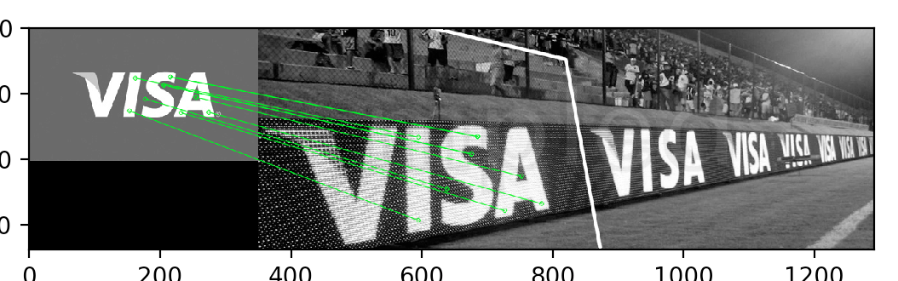
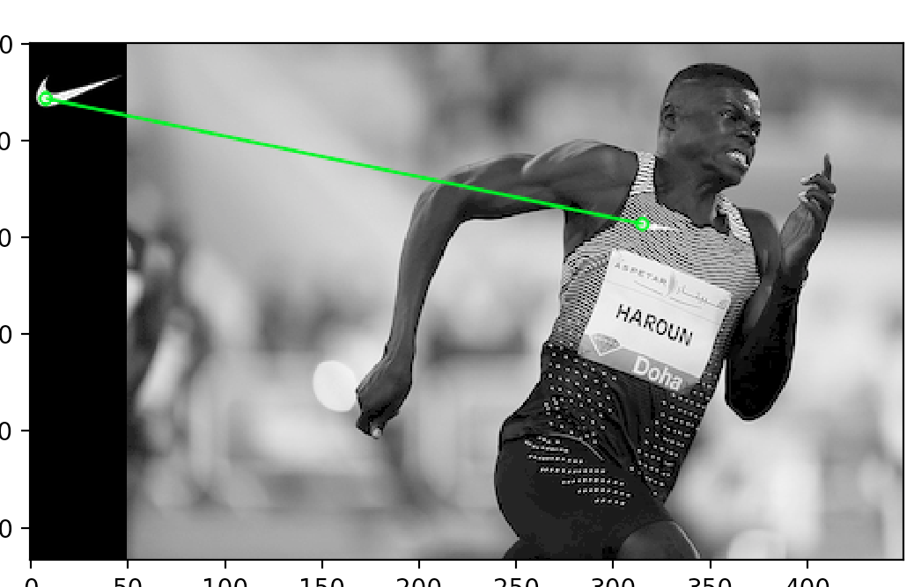

# Logo detection demo

A demo made possibile by [OpenCV's Feature Matching + Homography](https://docs.opencv.org/3.0-beta/doc/py_tutorials/py_feature2d/py_feature_homography/py_feature_homography.html).

```sh
python find.py
```




